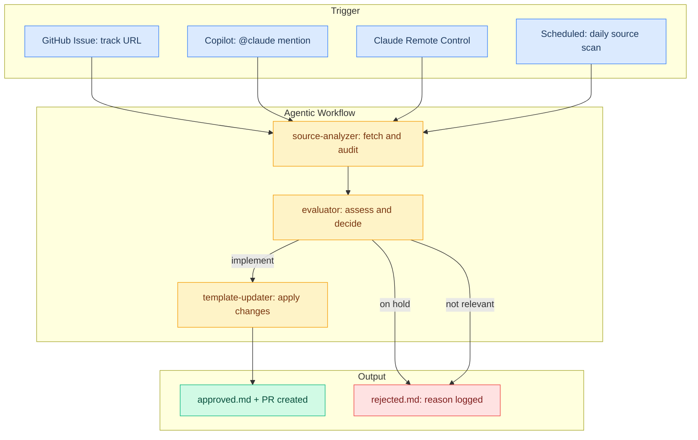

# Claude Code Template

This repository provides a starter template for configuring Claude Code with well-structured [building blocks](https://github.com/sercandumansiz/claude-code-template?tab=readme-ov-file#building-blocks). The [`starter-template/`](https://github.com/sercandumansiz/claude-code-template?tab=readme-ov-file#starter-template) directory contains ready-to-use configuration files that you can copy into your projects.

This project serves as both a Proof of Concept and a [Living Reference](https://github.com/sercandumansiz/claude-code-template?tab=readme-ov-file#living-reference). It uses the same [`starter-template/`](https://github.com/sercandumansiz/claude-code-template?tab=readme-ov-file#starter-template) configuration as its own operational setup. An automated ♻️ [pipeline](https://github.com/sercandumansiz/claude-code-template?tab=readme-ov-file#pipeline) continuously evaluates improvements and best practices, updating the template to maintain alignment with current standards. The agents continuously reference [official sources](https://github.com/sercandumansiz/claude-code-template?tab=readme-ov-file#official-sources) to ensure the template stays accurate and up to date.

## Quickstart

Copy the starter template into your project.

```bash
cp -rn starter-template/. your-project/
```

The `-n` flag skips existing files, so you can re-run this safely after template updates to pick up new files.

## Building Blocks

| Block | What It Does | Reliability | Eval | Docs |
|-----------|-------------|-------------|------|------|
| **CLAUDE.md** | Your project instructions. Claude reads them at the start of every session. | Always read. Instructions are advisory, not enforced. | 4/4 | [Docs](https://code.claude.com/docs/en/memory) |
| **Hooks** | Scripts that run before or after Claude uses a tool. Can block dangerous actions. | Always executed. Blocking decisions are enforced. | 24/24 | [Docs](https://code.claude.com/docs/en/hooks) |
| **Settings** | Controls what Claude can and cannot do. Permissions and environment. | Always applied. Deny rules are enforced. | 2/2 | [Docs](https://code.claude.com/docs/en/settings) |
| **Rules** | Instructions for specific file types. Load automatically when files match. | Always read. Same as CLAUDE.md: advisory, not enforced. | - | [Docs](https://code.claude.com/docs/en/memory#organize-rules-with-clauderules) |
| **Skills** | Reusable workflows. Trigger with `/command` or let Claude decide. | `/command` always works. Claude may skip auto-trigger. | 2/2 | [Docs](https://code.claude.com/docs/en/skills) |
| **Memory** | Knowledge Claude saves and recalls across sessions. | File loading is reliable. Auto-save depends on Claude's judgment. | - | [Docs](https://code.claude.com/docs/en/memory) |
| **Subagents** | Helper agents that handle tasks independently and report back. | Reliable for most tasks. | - | [Docs](https://code.claude.com/docs/en/sub-agents) |
| **MCP** | Connects Claude to external tools and services. | Local tools connect reliably. Remote tools may disconnect. | - | [Docs](https://code.claude.com/docs/en/mcp) |
| **Agent Teams** | Multiple Claude agents working together on shared tasks. | Experimental. Not enabled by default. | - | [Docs](https://code.claude.com/docs/en/agent-teams) |
| **Plugins** | Add-ons like code intelligence for your programming language. | Code intelligence is stable. Others vary. | - | [Docs](https://code.claude.com/docs/en/discover-plugins) |

> **Eval** column shows results from our [eval suite](evals/README.md). Hook tests are deterministic. LLM evals are single-run and results may vary. **Reliability** is based on official docs and community reports (March 2026).

## Starter Template

Every file includes inline guidance. Open and extend for your project.

```
starter-template/
├── CLAUDE.md                  Project instructions
├── CLAUDE.local.md            Personal overrides
├── .mcp.json                  MCP server connections
└── .claude/
    ├── settings.json          Permissions and environment
    ├── settings.local.json    Personal permission overrides
    ├── skills/                Skill template
    ├── rules/                 Rule template
    ├── agents/                Subagent template
    └── hooks/                 Hook script template
```

| File | What It Provides |
|------|-----------------|
| [`CLAUDE.md`](starter-template/CLAUDE.md) | Project instructions with sections for commands, style, architecture, and conventions |
| [`.claude/skills/`](starter-template/.claude/skills/) | Skill template with all configuration options documented |
| [`.claude/rules/`](starter-template/.claude/rules/) | Rule template showing global and file-scoped patterns |
| [`.claude/agents/`](starter-template/.claude/agents/) | Subagent template with all configuration options documented |
| [`.mcp.json`](starter-template/.mcp.json) | MCP server configuration for connecting external tools |
| [`.claude/hooks/`](starter-template/.claude/hooks/) | Hook script template with event list and common patterns |
| [`.claude/settings.json`](starter-template/.claude/settings.json) | 🌟 Shared permissions, hooks, and environment variables. TypeScript LSP plugin is included (`"enabledPlugins": {"typescript-lsp@claude-plugins-official": true}`) and can be configured ([docs](https://code.claude.com/docs/en/discover-plugins#code-intelligence)). Auto memory is enabled by default (`"autoMemoryEnabled": true`) and can be configured ([docs](https://code.claude.com/docs/en/memory#storage-location)). |
| [`CLAUDE.local.md`](starter-template/CLAUDE.local.md) | Personal project overrides |
| [`.claude/settings.local.json`](starter-template/.claude/settings.local.json) | Personal permission overrides |

## 📌 Configuration Levels

Claude Code supports 4 levels. Higher levels override lower ones.

| Level | Location | Shared? | Priority |
|-------|----------|---------|----------|
| **Managed** | System directories | Yes (system-wide) | Highest |
| **Local** | `.claude/*.local.*` | No | High |
| **Project** | `.claude/` in repo | Yes (git) | Medium |
| **User** | `~/.claude/` | You only | Base |

## 🧩 Context Engineering

| Tool | Description |
|------|-------------|
| [Context7](https://context7.com/) | Up-to-date, version-specific library documentation for AI coding tools |

> For a deeper dive, see [Context Engineering for Coding Agents](https://martinfowler.com/articles/exploring-gen-ai/context-engineering-coding-agents.html) by Martin Fowler.

## 🌱 Living Reference

This repository uses its own template. Root `.claude/` is this project's real config; `starter-template/` is the generic template you copy.

### Pipeline



Pipeline decisions are logged in [`agentic-workflow-output/`](agentic-workflow-output/):

| File | Logs | Written by |
|------|------|-----------|
| [`approved.md`](agentic-workflow-output/approved.md) | Implemented updates with PR links | Main session, after template-updater completes |
| [`rejected.md`](agentic-workflow-output/rejected.md) | Skipped or on-hold updates with reasons | Main session, after evaluator decides |

## 🔖 Official Sources

Built from the official Claude Code documentation.

- [Claude Code Docs](https://code.claude.com/docs)
- [Best Practices](https://code.claude.com/docs/en/best-practices)
- [Effective CLAUDE.md](https://code.claude.com/docs/en/best-practices#write-an-effective-claude-md)
- [The Complete Guide to Building Skills](https://resources.anthropic.com/hubfs/The-Complete-Guide-to-Building-Skill-for-Claude.pdf?hsLang=en)
- [Context Engineering for Coding Agents](https://martinfowler.com/articles/exploring-gen-ai/context-engineering-coding-agents.html)

## Contributing

Found something worth tracking? Share it by [creating an issue](https://github.com/sercandumansiz/claude-code-template/issues/new) with,

- **Title:** `track: <URL>`
- **Body:** Optional notes or context

I will review and run the pipeline if relevant.
