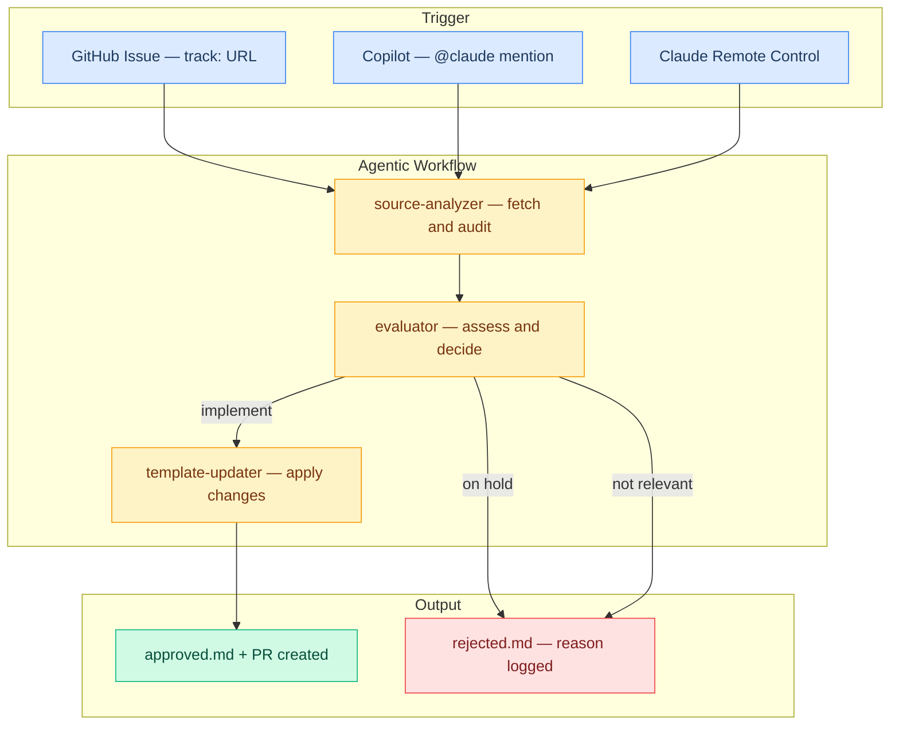

# Claude Code Template

A starter template for extending [Claude Code](https://code.claude.com/docs). Copy `starter-template/` into your project and start working with a well-structured Claude.

## Building Blocks

| Block | What It Does | Docs |
|-----------|-------------|------|
| **CLAUDE.md** | Your project's instructions — loaded at the start of every session | [Docs](https://code.claude.com/docs/en/memory) |
| **Skills** | Teachable workflows and knowledge Claude can use or you can invoke | [Docs](https://code.claude.com/docs/en/skills) |
| **Memory** | Knowledge Claude saves for itself and recalls across sessions | [Docs](https://code.claude.com/docs/en/memory) |
| **Rules** | Guidelines that apply automatically when Claude works with matching files | [Docs](https://code.claude.com/docs/en/memory#organize-rules-with-clauderules) |
| **Agent Teams** | Multiple Claude instances working together on shared tasks | [Docs](https://code.claude.com/docs/en/agent-teams) |
| **Subagents** | Specialized helpers that run independently and report back | [Docs](https://code.claude.com/docs/en/sub-agents) |
| **MCP** | Connections to external tools and services | [Docs](https://code.claude.com/docs/en/mcp) |
| **Hooks** | Scripts that run automatically at specific moments in Claude's workflow | [Docs](https://code.claude.com/docs/en/hooks) |
| **Settings** | Permissions, environment variables, and plugin configuration | [Docs](https://code.claude.com/docs/en/settings) |
| **Plugins** | Add-ons like language server support for code intelligence | [Docs](https://code.claude.com/docs/en/discover-plugins) |

## Starter Template

Every file includes inline guidance — open and extend for your project.

```
starter-template/
├── CLAUDE.md                  Project instructions
├── CLAUDE.local.md            Personal overrides
├── .mcp.json                  MCP server connections
├── gitignore                  Gitignore template
└── .claude/
    ├── settings.json          Permissions and environment
    ├── settings.local.json    Personal permission overrides
    ├── skills/                Skill template
    ├── rules/                 Rule template
    ├── agents/                Subagent template
    └── hooks/                 Hook script template
```

| File | What It Provides |
|------|-----------------|
| [`CLAUDE.md`](starter-template/CLAUDE.md) | Project instructions with sections for commands, style, architecture, and conventions |
| [`.claude/skills/`](starter-template/.claude/skills/) | Skill template with all configuration options documented |
| [`.claude/rules/`](starter-template/.claude/rules/) | Rule template showing global and file-scoped patterns |
| [`.claude/agents/`](starter-template/.claude/agents/) | Subagent template with all configuration options documented |
| [`.mcp.json`](starter-template/.mcp.json) | MCP server configuration for connecting external tools |
| [`.claude/hooks/`](starter-template/.claude/hooks/) | Hook script template with event list and common patterns |
| [`.claude/settings.json`](starter-template/.claude/settings.json) | Shared permissions, hooks, and environment variables |
| [`CLAUDE.local.md`](starter-template/CLAUDE.local.md) | Personal project overrides |
| [`.claude/settings.local.json`](starter-template/.claude/settings.local.json) | Personal permission overrides |
| [`gitignore`](starter-template/gitignore) | Gitignore template (copy as `.gitignore`) |

## Configuration Levels

Claude Code supports 4 levels — higher levels override lower ones, arrays are merged:

| Level | Location | Shared? | Priority |
|-------|----------|---------|----------|
| **Managed** | System directories | Yes (system-wide) | Highest |
| **Local** | `.claude/*.local.*` | No | High |
| **Project** | `.claude/` in repo | Yes (git) | Medium |
| **User** | `~/.claude/` | You only | Base |

## Living Reference

This repository uses its own template. Root `.claude/` is this project's real config; `starter-template/` is the generic template you copy.

### Pipeline



Pipeline decisions are logged in [`agentic-workflow-output/`](agentic-workflow-output/):

| File | Logs | Written by |
|------|------|-----------|
| [`approved.md`](agentic-workflow-output/approved.md) | Implemented updates with PR links | Main session, after template-updater completes |
| [`rejected.md`](agentic-workflow-output/rejected.md) | Skipped or on-hold updates with reasons | Main session, after evaluator decides |

## Official Sources

Built from the official Claude Code documentation:

- [Claude Code Docs](https://code.claude.com/docs)
- [Best Practices](https://code.claude.com/docs/en/best-practices)
- [Effective CLAUDE.md](https://code.claude.com/docs/en/best-practices#write-an-effective-claude-md)
- [The Complete Guide to Building Skills](https://resources.anthropic.com/hubfs/The-Complete-Guide-to-Building-Skill-for-Claude.pdf?hsLang=en)
- [Context Engineering for Coding Agents](https://martinfowler.com/articles/exploring-gen-ai/context-engineering-coding-agents.html)
