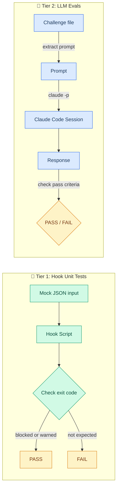

# Eval Suite

## Results

Last tested: 2026-03-02

| Tier | Pass | Total | Note |
|------|------|-------|------|
| Hook Unit Tests | 24 | 24 | Deterministic. Same result every run. |
| LLM Evals | 8 | 8 | Single run. Results may vary between sessions. |
